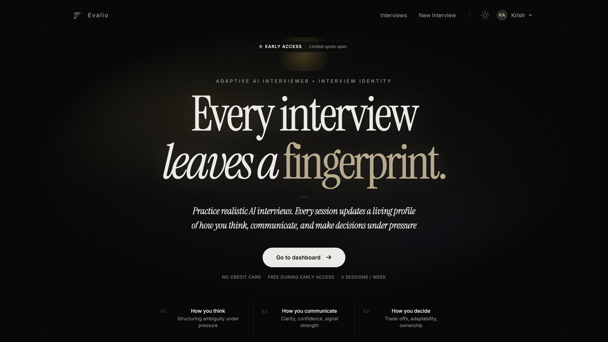

# Evalio

Real-time AI interview simulator. Practice technical and behavioral interviews with voice, code, and system design — with an AI that adapts to your target company, role, and preferred style.

<p align="center">
  
</p>

### Features

| Area                 | Capabilities                                                                                              |
| -------------------- | --------------------------------------------------------------------------------------------------------- |
| **Voice Interview**  | Real-time bidirectional audio, AI can interrupt, incremental live transcription                           |
| **DSA Coding**       | LeetCode-style problems, in-browser editor (Python/C++/TS), event-driven code review                      |
| **System Design**    | Excalidraw whiteboard, AI reads your diagrams, canvas suggestions via structured markers                  |
| **Company Profiles** | 16 companies with culture, interviewer behavior, and role-specific topics                                 |
| **Interview Styles** | Supportive, Professional, Challenging, Bar Raiser — each with different interruption and probing patterns |
| **Depth Levels**     | Standard, Probing, Challenge, Bar Raiser — control how many follow-ups and how hard                       |
| **Rounds**           | Company-specific round selection (Phone Screen, Technical Deep Dive, System Design, Behavioral)           |
| **Resume & GitHub**  | Upload resume or link GitHub for personalized, targeted questions                                         |
| **Evaluation**       | Post-interview AI scoring across 6 dimensions, skill profile tracking over time                           |
| **Queue System**     | Redis-backed FIFO queue when session limit is reached, real-time position updates                         |

## Architecture

```
ai-interview/
├── apps/
│   ├── backend/          # Elysia.js HTTP server + WebSocket server
│   │   ├── src/
│   │   │   ├── prompt.ts         # Dynamic prompt assembly engine
│   │   │   ├── gemini.ts         # AI session wrapper (model-agnostic interface)
│   │   │   ├── ws/
│   │   │   │   ├── index.ts      # WebSocket server entry
│   │   │   │   ├── session.ts    # InterviewConnection class
│   │   │   │   ├── dedup.ts      # Transcription deduplication
│   │   │   │   └── finalize.ts   # Post-interview finalization
│   │   │   ├── lib/
│   │   │   │   ├── redis.ts      # Redis client (queue backend)
│   │   │   │   ├── queue.ts      # Queue helpers (tryActivate, enqueue, dequeue)
│   │   │   │   └── email.ts      # Email templates (OTP, welcome, feedback)
│   │   │   └── routes/           # Auth, user, resume, interview, feedback, pricing
│   │   └── prisma/               # PostgreSQL schema + migrations
│   └── frontend/                 # React 19 SPA
│       └── src/
│           ├── pages/            # NewInterview, Interview, Results, Dashboard, Feedback, Pricing
│           ├── components/       # CompanyGrid, RolePicker, SessionControls, InterviewQueue, Landing*
│           ├── hooks/            # useMicrophone, useAudioPlayer
│           └── lib/              # WebSocket client, API client, auth
├── packages/
│   ├── shared/                   # Zod schemas, shared types, company configs
│   ├── ui/                       # Shared UI primitives
│   ├── eslint-config/
│   └── typescript-config/
```

## Features

### Voice Interview Engine

- **Real-time bidirectional audio** via WebSocket + AI audio API
- **AI can interrupt** mid-answer when answers go off-track
- **User cannot interrupt AI** — mic blocked during AI speech
- **Incremental transcription** with character-level deduplication

### 16 Company Profiles

Each company has structured culture, interviewer behavior, and role-specific interview data:

| Company       | Style        | Depth      | Roles                               |
| ------------- | ------------ | ---------- | ----------------------------------- |
| Stripe        | Challenging  | Challenge  | Backend, Payments, Platform         |
| Amazon        | Bar Raiser   | Challenge  | SDE, PM, Solutions Architect        |
| Google        | Professional | Probing    | SWE, Data Scientist, UX Engineer    |
| Meta          | Challenging  | Probing    | Frontend, ML, Infrastructure        |
| Netflix       | Bar Raiser   | Bar Raiser | Backend, Data, SRE                  |
| Microsoft     | Professional | Standard   | SWE, DevOps, AI Engineer            |
| Apple         | Challenging  | Probing    | iOS, Hardware, Security             |
| Uber          | Professional | Challenge  | Backend, Mobile, Data Science       |
| Airbnb        | Supportive   | Probing    | Fullstack, Design, Staff            |
| Datadog       | Professional | Standard   | SRE, Cloud, Support                 |
| Deloitte      | Professional | Probing    | Consultant, Data Analyst, Cloud     |
| Goldman Sachs | Bar Raiser   | Challenge  | Quant Dev, Risk, Platform           |
| Palantir      | Challenging  | Bar Raiser | FDE, Data, Security                 |
| Figma         | Supportive   | Standard   | Design Engineer, Frontend, Platform |
| Notion        | Supportive   | Standard   | Fullstack, Mobile, Infra            |
| Startup       | Supportive   | Challenge  | CTO, Founder, Staff                 |

Roles define `topics`, `evaluationCriteria`, and `mustProbe` — so a Stripe Backend interview (distributed systems, APIs, caching) is completely different from a Stripe PM interview (prioritization, metrics, stakeholder management) even with the same style and depth.

### 4 Interview Styles

Controls _how_ questions are asked:

| Style            | Approach                      | Interruption                            |
| ---------------- | ----------------------------- | --------------------------------------- |
| **Supportive**   | Conversational, encouraging   | Rare, gentle redirection                |
| **Professional** | Structured, neutral           | When unfocused or repetitive            |
| **Challenging**  | High-pressure, push for depth | Aggressive, cut off off-track answers   |
| **Bar Raiser**   | Elite, surgical               | Strategic — highest leverage point only |

### 4 Interaction Depths

Controls _how many_ follow-ups and _how hard_ each question is probed:

| Depth      | Follow-ups     | Challenge Level               |
| ---------- | -------------- | ----------------------------- |
| Standard   | None           | Smooth, conversational        |
| Probing    | 1-2 per topic  | Gentle elaboration requests   |
| Challenge  | Until defended | Disagree, demand metrics      |
| Bar Raiser | Maximum rigor  | Skepticism, evidence required |

### Interview Round Selection

- 4 unique rounds per company (e.g., Stripe: Phone Screen, Technical Deep Dive, System Design, Leadership & Behavior)
- Custom round input for roles not listed
- Progress stepper showing step position in setup flow

### Prompt Assembly Engine

Instead of a single static prompt, the system assembles a dynamic prompt from layers:

```
Interview Objective           ← Optimize for signal, not coverage
Candidate History             ← Past scores, strengths, weaknesses
Company Context               ← Culture + Interviewer Approach
Role Context                  ← Topics + Evaluation Criteria + Must Probe
Interview Style               ← How to ask
Interaction Depth             ← How many follow-ups
Resume / GitHub / JD          ← Personalization data
Evaluation Dimensions         ← What to assess (6 dimensions)
Story Extraction              ← Identify reusable stories
Interview Guidelines          ← Practical rules
```

Impact weighting: **Role ~60%** (drives what gets asked), **Style ~25%** (how), **Company ~10%** (cultural emphasis), **Depth ~5%** (follow-up count).

### Evaluation & Scoring

- Post-interview evaluation via AI
- Per-turn scoring with feedback
- 6 dimension scores: Communication, Technical Depth, Problem Solving, Leadership, Ownership, Decision Making
- Resume-strength correlation
- Candidate skill profile updates over time
- Candidates can retake interviews after 7 days (FREE tier: 3/week)

### Queue Management System

- Redis-backed FIFO queue when concurrent session limit is reached
- MAX_CONCURRENT_SESSIONS=4 (configurable)
- Real-time position updates pushed to waiting clients
- Heartbeat (30s ping / 10s timeout) to detect stale connections
- Automatic slot release and dequeue when an interview ends

### Feedback System

- Premium editorial feedback form with Tabler-style icons and progressive bar rating
- Categories: Bug Report, Feature Request, Performance, UX, Other
- Admin dashboard for reviewing all feedback
- Automated thank-you email via Resend

### Pricing & Rate Limits

- **FREE tier**: 3 interviews / 7 days, 15 min cap
- **PRO tier**: 6 interviews / 7 days, 30 min cap (contact for upgrade)
- **Max tier**: Coming soon
- Custom toast notifications for rate limit errors with upgrade links

### Real-time Audio Pipeline

```
Browser Mic → PCM 16kHz → WebSocket → AI Audio API → Audio + Transcription → Browser Speaker
     │                           │
     └── audio_stream_end ───────┘
```

### DSA Coding Round (Coming Soon)

- LeetCode-style problems sourced from company-specific question data
- 1900+ companies with real historical question frequency data
- 6-phase interview: Understanding → Brute Force → Optimization → Implementation → Testing → Review
- Event-driven code review (no auto-snapshots, AI reviews on request only)
- Hidden rubric per question guides AI evaluation
- Monaco Editor in-browser with Python/C++/TypeScript support
- 25 min fixed timer with phase tracking

### Additional Features

- **Resume upload & analysis** — PDF parsing, section detection, AI-tailored questions
- **GitHub integration** — public repo analysis for code-specific questions
- **Job description parsing** — paste a JD for targeted questions
- **Custom company & role** — AI generates interview context on the fly
- **Email verification** — OTP via Resend
- **Interview history** — dashboard with scores, feedback, improvement tracking
- **Role-based access control** — FREE, PRO, ADMIN tiers with different limits

## Tech Stack

| Layer     | Technology                                          |
| --------- | --------------------------------------------------- |
| Runtime   | [Bun](https://bun.sh) 1.3+                          |
| Backend   | [Elysia.js](https://elysiajs.com)                   |
| Frontend  | React 19, [motion](https://motion.dev) (animations) |
| Database  | PostgreSQL + [Prisma](https://prisma.io)            |
| AI        | Multi-model (Gemini, more coming)                   |
| Real-time | WebSocket (`ws`)                                    |
| Queuing   | Redis                                               |
| Auth      | JWT + OTP                                           |
| Email     | Resend                                              |
| CSS       | Tailwind CSS 4                                      |
| Icons     | react-icons, Tabler Icons                           |
| Monorepo  | [Turborepo](https://turbo.build)                    |

## Quick Start

### Prerequisites

- **Bun** 1.3+ (`curl -fsSL https://bun.sh/install | bash`)
- **PostgreSQL** running locally or remotely
- **Redis** running locally or remotely (for queue system)
- **AI API key** (Gemini or compatible)

### Setup

```bash
# Install dependencies
bun install

# Copy environment files
cp apps/backend/.env.example apps/backend/.env
cp apps/frontend/.env.example apps/frontend/.env

# Set up your .env files
# apps/backend/.env requires:
#   DATABASE_URL=postgresql://...
#   AI_API_KEY=your_key
#   JWT_SECRET=...
#   RESEND_API_KEY=...
#   REDIS_HOST=localhost
#   WS_PORT=8080
#   MAX_CONCURRENT_SESSIONS=4
#
# apps/frontend/.env requires:
#   VITE_API_HOST=http://localhost:3000
#   VITE_WS_HOST=localhost:8080

# Run database migrations
bun run --filter @evalio/db prisma migrate dev

# Start development servers
bun run dev
```

### Access

| Service   | URL                   |
| --------- | --------------------- |
| Frontend  | http://localhost:5173 |
| API       | http://localhost:3000 |
| WebSocket | ws://localhost:8080   |

## Commands

| Command                                 | Description                                     |
| --------------------------------------- | ----------------------------------------------- |
| `bun run dev`                           | Start all apps in development mode (hot reload) |
| `bun run build`                         | Build all apps and packages                     |
| `bun run lint`                          | Run ESLint across all packages                  |
| `bun run check-types`                   | Run TypeScript type checking                    |
| `bun run format`                        | Format code with Prettier                       |
| `bun run --filter @evalio/backend dev`  | Backend only                                    |
| `bun run --filter @evalio/frontend dev` | Frontend only                                   |

## API Overview

### HTTP Routes

| Method | Path                      | Description                        |
| ------ | ------------------------- | ---------------------------------- |
| POST   | `/api/auth/signup`        | Register with email + password     |
| POST   | `/api/auth/verify-otp`    | Verify email with OTP              |
| POST   | `/api/auth/login`         | Login, receive JWT                 |
| GET    | `/api/interviews`         | List user's interviews             |
| POST   | `/api/interviews`         | Create new interview               |
| GET    | `/api/interviews/:id`     | Get interview details              |
| POST   | `/api/resumes/upload`     | Upload resume (PDF)                |
| GET    | `/api/github/profile`     | Get linked GitHub profile          |
| POST   | `/api/companies/generate` | AI-generate custom company context |
| POST   | `/api/feedback/submit`    | Submit feedback                    |
| GET    | `/api/feedback`           | List feedbacks (admin only)        |

### WebSocket Messages

| Direction | Type                 | Purpose                                  |
| --------- | -------------------- | ---------------------------------------- |
| Client →  | `init`               | Authenticate, start interview session    |
| Client →  | `audio_chunk`        | Send PCM audio data                      |
| Client →  | `audio_stream_end`   | Signal end of user speech                |
| Client →  | `end_interview`      | Request closing + evaluation             |
| Server →  | `ready`              | Interview initialized, listening         |
| Server →  | `serverContent`      | AI speech (audio + transcription)        |
| Server →  | `queued`             | Session queued (position in queue)       |
| Server →  | `position_update`    | Queue position changed                   |
| Server →  | `closing_started`    | Interview entering closing phase         |
| Server →  | `feedback_ready`     | Evaluation complete, navigate to results |
| Server →  | `time_limit`         | Total interview duration                 |
| Server →  | `time_warning`       | 1 minute remaining                       |
| Server →  | `time_limit_reached` | Time expired, closing triggered          |

## Key Design Decisions

### Why Structured Company/Role Data Instead of Free-form Personality

Free-form personality strings caused the AI to produce similar interviews across roles at the same company. By splitting into `culture` (company values), `interviewerBehavior` (approach), and role-specific `topics`, `evaluationCriteria`, and `mustProbe`, the generated interview varies meaningfully by role. Impact: Role ~60%, Style ~25%, Company ~10%, Depth ~5%.

### Challenge Mode Turn Accumulation

In standard interview modes, each Q&A creates a new database turn. In Challenge and Bar Raiser modes, multiple user answers accumulate into a single turn until the AI asks a new question (detected via `isNewQuestion()` heuristic). This gives the AI room to challenge, probe, and redirect without creating spurious turn boundaries.

### AI Interruption Without Backend Round-trip

Interruption is detected on the frontend: when AI sends audio while the user is speaking, the mic is stopped immediately and `audio_stream_end` is sent. No backend round-trip needed, keeping latency low.

### Redis Queue for Session Management

Instead of Kafka or PostgreSQL-based queuing, the system uses Redis Sorted Sets for FIFO queuing and Redis Sets for tracking active sessions. This provides O(log N) queue operations and real-time position updates without the overhead of a full message broker.

### Event-Driven Code Snapshots (DSA)

DSA rounds use event-driven code snapshots instead of auto-snapshots every 10 seconds. Code is sent only when the user requests review, clicks Run, says "I'm done," or the AI asks to see the current implementation — reducing storage and token cost by ~95%.

### Prompt Layering

Instead of one monolithic system prompt, the prompt is assembled from independent sections (Objective, Company Context, Role Context, Style, Depth, Resume, Guidelines). Each section is independently maintainable and conditionally included. This makes it easy to tweak individual behaviors without affecting the rest.

## License

MIT
